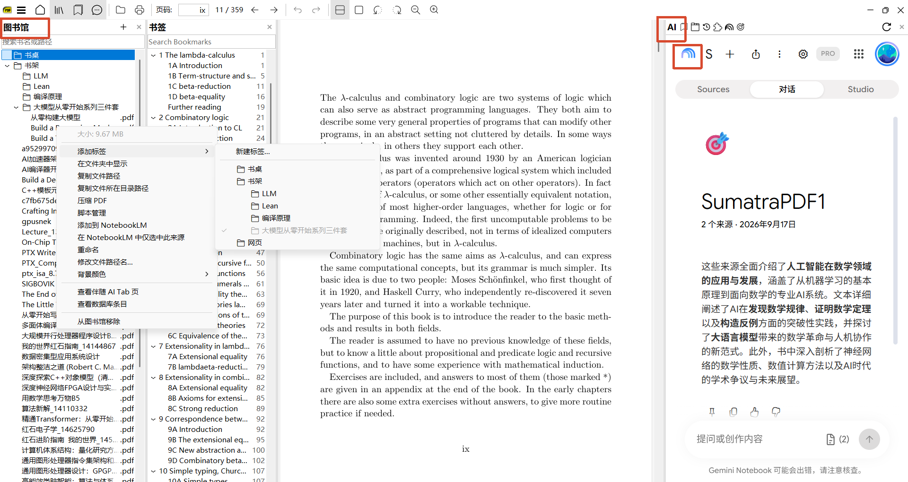
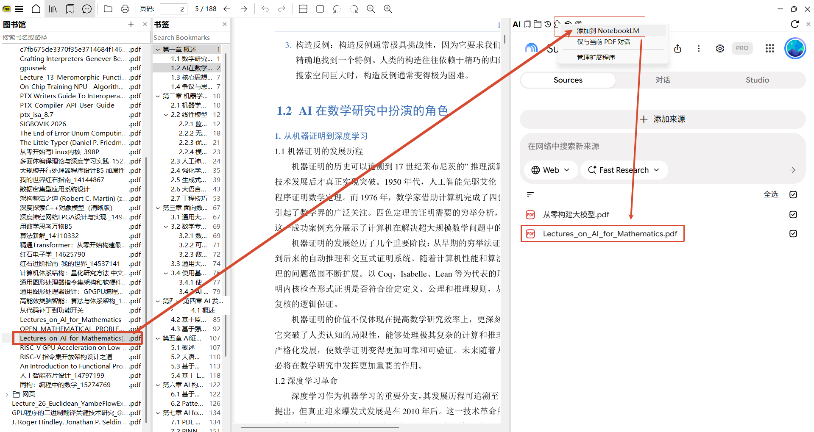
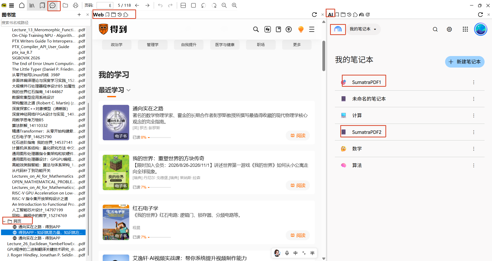

# SumatraPDF — browsers / agents fork

Fork of [SumatraPDF](https://www.sumatrapdfreader.org/) with a portable SQLite **图书馆**, dual WebView2 browsers (**Browser-AIChat** CDP 9224 · **Browser-Library** CDP 9225), NotebookLM host plugins, and Playwright automation.

Repo: https://github.com/tingaidehua/sumatrapdf-browsers-agents  
Default branch for this work: `feature/library-sidebar`







## Build (Windows)

Requirements:

| Tool | Notes |
|------|--------|
| [Bun](https://bun.sh/) | `bun cmd/build.ts …` |
| Visual Studio **2022 or 2026** + MSBuild | C++ desktop workload |
| WebView2 Evergreen Runtime | [Download](https://developer.microsoft.com/microsoft-edge/webview2/) |
| WebView2 SDK | Vendored under `packages/Microsoft.Web.WebView2.*` (already in repo) |

```bash
bun cmd/build.ts -debug
# → out/dbg64/SumatraPDF.exe

bun cmd/build.ts -release
# → out/rel64/SumatraPDF.exe
```

For ad-hoc testing always pass `-for-testing` so settings/session of a daily install are not overwritten.

## Runtime: NotebookLM / Playwright scripts

C++ launches Node scripts from `scripts/webview/`. On first AI-panel open the app:

1. Locates the repo copy by walking up from the EXE (so any clone path works), or uses `SUMATRA_SCRIPTS`
2. Syncs sources into `%AppData-or-OneDrive%\SumatraPDF\scripts\webview\` (no `node_modules`)

Then install deps **once** (either location is fine; appdata is preferred when present):

```bash
cd scripts/webview          # or the synced appdata folder
npm ci
# Playwright talks to the live WebView2 over CDP — no separate Chromium browser required for add/select/chat
```

Optional env:

| Variable | Meaning |
|----------|---------|
| `SUMATRA_NODE` | Full path to `node.exe` if not on PATH |
| `SUMATRA_SCRIPTS` | Folder containing `package.json` (overrides discovery) |

Sign into Google / NotebookLM once inside the **AI** sidebar (profile under `%LOCALAPPDATA%\SumatraPDF\WebPanel\profile\Browser-AIChat\`).

## Layout (shared app data)

**Synced** (OneDrive when available, else beside EXE): small settings / library / tabs.

| Path | Role |
|------|------|
| `SumatraPDF-library.db` | 图书馆 SQLite |
| `WebPanel/tabs/`, `WebPanel/bridge/` | tab session, pdf-map, CDP bridge JSON |
| `extensions/installed/<id>/` | host `plugin.json` + unpacked Chromium `manifest.json` |
| `extensions/overlays/<id>.json` | overlay 描述（仅 JSON，进 git）；Chrome 包体运行时拷到 LocalAppData |
| `scripts/webview/` | synced Playwright helpers |

**Local only** (`%LOCALAPPDATA%\SumatraPDF\WebPanel\` — not OneDrive):

| Path | Role |
|------|------|
| `profile/Browser-AIChat/` | AI WebView2 user data (CDP 9224) |
| `profile/Browser-Library/` | center Web user data (CDP 9225) |
| `jobs/`, `cache/` | CDP job queue + favicons |

On first launch after upgrade, heavy folders are moved off OneDrive automatically.

Built-in host plugins (AI puzzle menu only): **添加到 NotebookLM**, **仅与当前 PDF 对话** — operate on the center pane (PDF or webpage).

## Docs

- `scripts/webview/README.md` — CLI / CDP / flywheel
- `extensions/README.md` — plugin layout
- `agents.md` — upstream-oriented agent notes + this fork’s appdata paths

Upstream SumatraPDF: [Website](https://www.sumatrapdfreader.org/free-pdf-reader) · [Manual](https://www.sumatrapdfreader.org/manual) · [Contribute](https://www.sumatrapdfreader.org/docs/Contribute-to-SumatraPDF)
